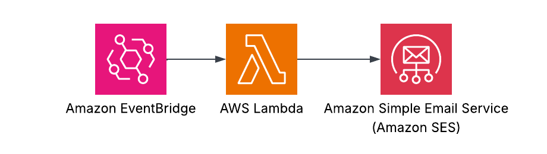

# 📧 Daily Emails: a Terraform learning project

A small personal project for learning Terraform by building a daily email service. An Amazon EventBridge Scheduler triggers a Lambda function daily at 5:30 PM, which sends an email through Amazon SES.

## 🗺️ Overview


## 🎯 Goals of this Project:
- To understand how to effectively use Terraform to provision, update, and destroy cloud infrastructure
- Understanding how to develop secure serverless architecture
- How to properly provision a Terraform stack to be reproducible

## 🧰 Key Skills Used

-  **Terraform**
    - Variables 
    - State
    - Modules
    - Providers and version constraints
    - Resources and data sources
    - Outputs
    - Dependency management
    - Planning and applying infrastructure changes
-  **AWS**
    - EventBridge 
    - Lambda 
    - Simple Email Service
    - IAM Roles

## 💭 Reflection / What I Learned:

### ☁️ Getting Used to Cloud Configuration

Before learning about Terraform, I primarily configured AWS resources using the AWS Console. It was tedious and time-consuming. Learning to use Terraform effectively, even at a basic level, has been game-changing for me. I can now provision cloud resources with a few lines of configuration and a few commands instead of painstakingly working through the AWS Console. Using the cloud used to be intimidating because I worried about being charged for resources I did not know were running. Even keeping unused resources alive costs money. Terraform gives me more control over costs and more agency in my cloud automation engineering career journey.

### ⚡ Appreciating Serverless Architecture

One thing I appreciate about AWS is its early promotion of serverless architecture. The more I learn about systems design, the more I understand why cloud providers are so successful. Keeping a server from crashing is hard enough; ensuring it handles requests with queues, load balancers, and other infrastructure is another challenge. Services such as SQS and ALB let AWS handle parts of the infrastructure that I am less comfortable managing. Cloud providers can be complex, but they are often more manageable than operating physical machines directly.

### 🔐 Security Concerns

One area of AWS that I found challenging was IAM roles. Manually creating them in the AWS Console took time that I could have spent elsewhere. With Terraform, creating and provisioning them is much easier. When you view software beyond feature development, security becomes a much bigger concern. Many people instinctively understand the principle of least privilege, but applying it in practice can be difficult. That is where my expertise comes in.

### ✨ Final Thoughts

The scope of the job market has changed as AI makes code easier to create. This project was AI-assisted, but I still needed to read the Terraform documentation, watch tutorials, and experiment in the terminal to understand the work. This project is the start of a new chapter in my career journey.

## 🚀 Possible Next Steps!
- Add a dedicated VPC and an RDS or DynamoDB database
- Add another Lambda Function that gets a random message from the newly created database and send message to the current Lambda that sends it using SES
- Instead of having event bridge trigger the lambda, create step function that triggers the database lambda, which sends the message to the SES Lambda
- Since RDS or DynamoDB would be a private database, put all resources into their proper private and public subnets within the VPC

## 🛠️ Do It Yourself!

### ✅ Prerequisites

- Terraform
- AWS CLI
- An email address or domain verified in Amazon SES

1. Clone this repository and enter the project directory.

   ```bash
   git clone <repository-url>
   cd daily-email
   ```

2. Create your local variables file from the provided template, then update its placeholder values.

   ```bash
   cp example.tfvars variables.tfvars
   ```

   Set `from_email` to an address that uses your SES-verified identity.

3. Install dependencies and create the Lambda deployment package.

   ```bash
   cd email-lambda
   npm install
   npm run zip
   cd ..
   ```

4. Initialize Terraform. This project uses Terraform's default local backend, so no `backend.hcl` file is required or created.

   ```bash
   terraform init
   ```

5. Optionally format, validate, and review the proposed changes.

   ```bash
   terraform fmt -check -recursive
   terraform validate
   terraform plan -var-file=variables.tfvars
   ```

6. Provision the project.

   ```bash
   terraform apply -var-file=variables.tfvars -auto-approve
   ```

7. Remove the project when finished to avoid ongoing AWS charges.

   ```bash
   terraform destroy -var-file=variables.tfvars -auto-approve
   ```
